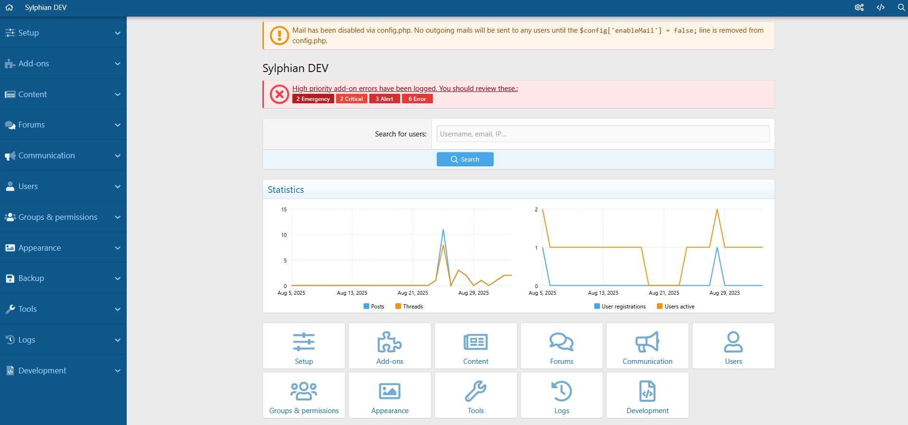
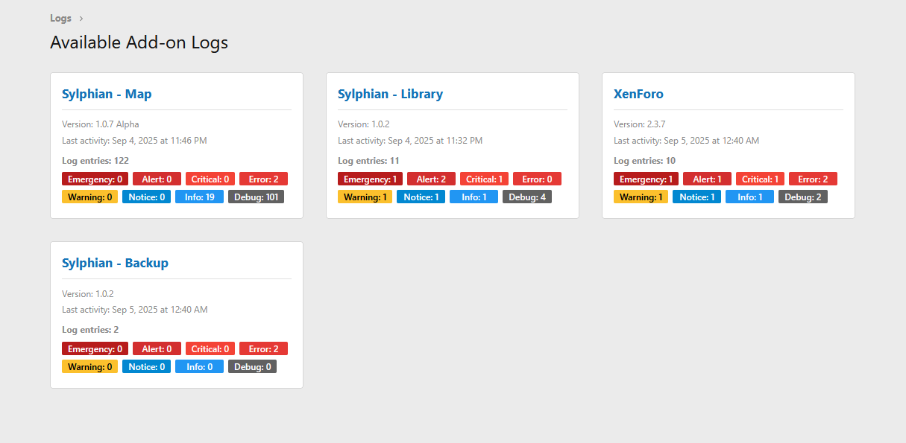
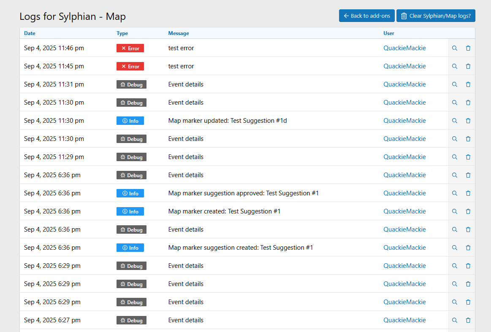

# Sylphian-Library

Sylphian Library is a utility add-on for XenForo that provides centralised logging functionality for other add-ons. It allows developers to create, store, and manage logs from their add-ons with different severity levels and additional contextual information.

## Table of Contents
- [Requirements](#requirements)
- [Log Levels](#log-levels)
- [Log Retention](#log-retention)
- [Usage](#usage)
    - [Basic Usage](#basic-usage)
        - [Universal Log Method](#universal-log-method)
        - [loggedError Method](#loggederror-method)
        - [Specifying Add-on ID](#specifying-add-on-id)
    - [Alternative Usage](#alternative-usage)
    - [Automatic Add-on Detection](#automatic-add-on-detection)
- [Preview](#preview)

## Requirements

These are the versions that have been tested. Other versions may work but are not officially supported.

- XenForo 2.3.7+
- PHP 8.3+

## Features

- Standardised logging interface for XenForo add-ons
- Ability to store additional contextual data with each log entry
- Admin interface for viewing and managing logs
- Automatic add-on identification

### Log Levels

The logger supports the following severity levels:

1. `Emergency` - System is unusable
2. `Alert` - Action must be taken immediately
3. `Critical` - Critical conditions
4. `Error` - Error conditions
5. `Warning` - Warning conditions
6. `Notice` - Normal but significant condition
7. `Info` - Informational messages
8. `Debug` - Debug-level messages

### Log Retention

Logs are automatically pruned based on the configured retention period in the Admin CP settings. You can adjust this setting to keep logs for longer or shorter periods based on your requirements.

---

## Usage

The Sylphian Library provides a standardised logging system that follows the PSR-3 logging interface. This section explains how to integrate and use logging functionality in your XenForo add-ons.

### Basic Usage

The simplest way to use the logging system is through the static Logger class:

```php
use Sylphian\Library\Logger\Logger;

// Log messages with different severity levels
Logger::info("User profile updated successfully");
Logger::warning("Invalid form submission attempt", ["form_data" => $formData]);
Logger::error("Failed to process payment");
Logger::debug("Debug information", ["debug_data" => $debugData]);
```

#### Universal log method

If you want to specify the severity level manually you can also use the universal log method:

```php
use Sylphian\Library\Logger\Logger;
use Psr\Log\LogLevel;

Logger::log(LogLevel::INFO, "User profile updated successfully"); 
Logger::log(LogLevel::INFO, "User profile updated successfully", ["user_id" => $userId]);
Logger::withAddonId('Vendor/Addon')->log(LogLevel::INFO, "User profile updated successfully");
```

#### loggedError method

In your controller actions, you can use the loggedError method to log errors and return a response:

```php
public function actionExample(): Error
{
    return Logger::loggedError('This is an example error');
}
```

You are still able to also manually set the add-on id like so as well as pass details:

```php
public function actionExample(): Error
{
    return Logger::withAddonId("Vendor/Addon")->loggedError('This is an example error', ["errorDetails" => "This is an example error details"]);
}
```

#### Specifying Add-on ID

If you need to specify an add-on ID explicitly, you can use the withAddonId method:

```php
use Sylphian\Library\Logger\Logger;

Logger::withAddonId("Vendor/Addon")->info("Configuration updated");
```

### Alternative Usage

While the static Logger class provides the most convenient way to use the logging system, you can also directly use the AddonLogger class for more advanced usage patterns.

#### Creating an AddonLogger Instance

You can create an instance of the `AddonLogger` class using the static factory method:
```php
use Sylphian\Library\Logger\AddonLogger;

$logger = AddonLogger::create('Vendor/Addon');
```

The method takes an optional parameter:

1. An add-on ID to use for all logs from this instance

#### Using the Logger Instance

Once you have an instance, you can call any of the PSR-3 logging methods:

```php
$logger->info('User logged in', ['user_id' => $userId]);
$logger->error('Failed to process payment', ['transaction_id' => $transactionId]);
```

### Automatic Add-on Detection

By default, the logging system automatically attempts to determine which add-on is creating logs by analyzing the call stack:

1. It examines the namespace of the calling code (up to 10 levels in the call stack)
2. It extracts the first two parts of the namespace (e.g., Sylphian\Example from Sylphian\Example\folder\subfolder)
3. It verifies if a valid add-on with that ID exists in the XenForo system
4. If found, it uses that add-on ID for the log entry

For example, if your code is in the namespace Sylphian\Example\folder\subfolder\ExampleFile, the logger will automatically detect Sylphian\Example as the add-on ID.

```php
namespace Sylphian\Example\folder\subfolder;

use Sylphian\Library\Logger\Logger;

class ExampleFile
{
    public function exampleMethod($userData)
    {
        // The add-on ID will be automatically detected as "Sylphian\Example"
        Logger::info("New user registration", ["user_data" => $userData]);
    }
}
```

## Preview
<details>
<summary>Click to expand the admin control panel warning preview</summary>



</details>

<details>
<summary>Click to expand the cards preview</summary>



</details>

<details>
<summary>Click to expand the logs menu preview</summary>



</details>